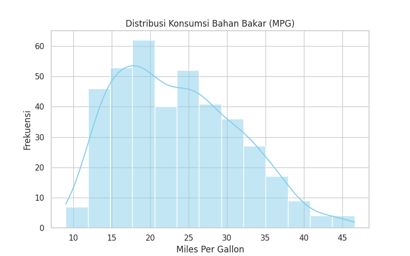
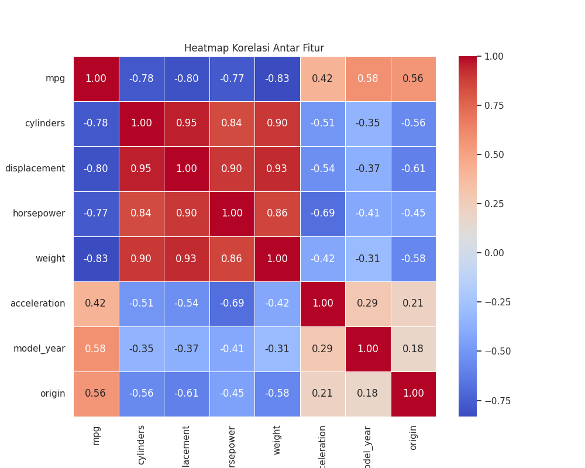
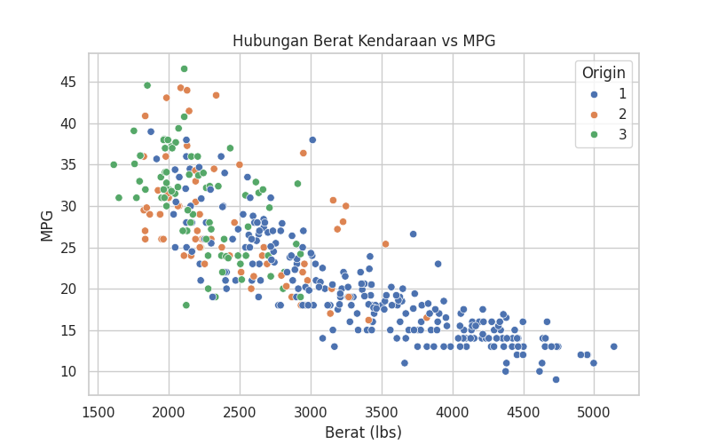
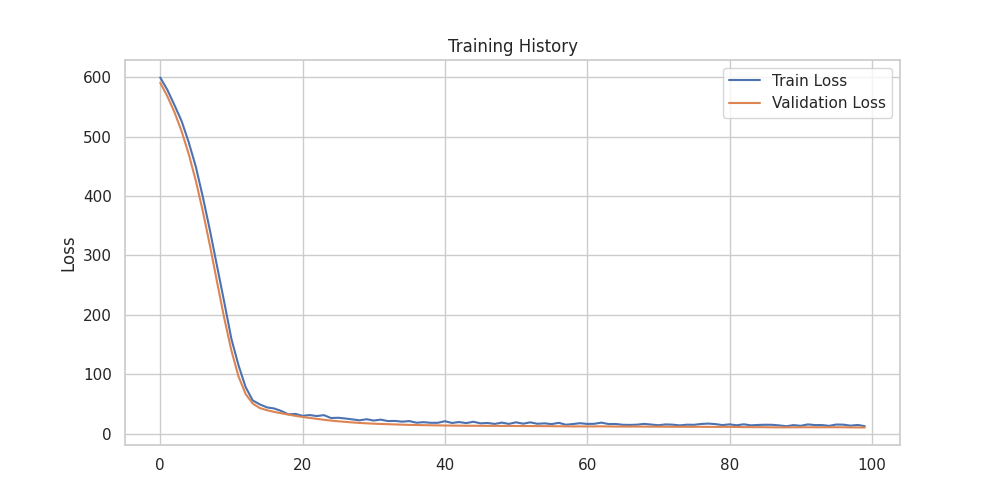
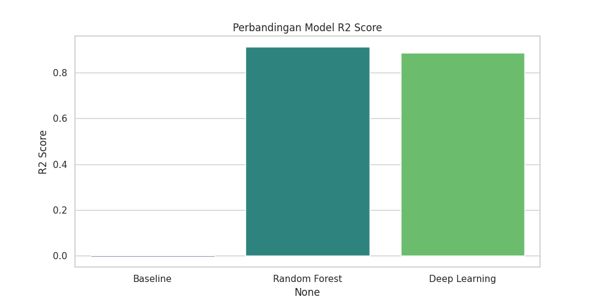

# INFORMASI PROYEK

**Judul Proyek:** Analisis Prediksi Konsumsi Bahan Bakar (MPG) Menggunakan Baseline, Machine Learning, dan Deep Learning

**Nama Mahasiswa:** Mohammad Dimas Bahrul Ikhwani  
**NIM:** 234311017  
**Program Studi:** Teknologi Rekayasa Perangkat Lunak  
**Mata Kuliah:** Machine Learning  
**Dosen Pengampu:** [Masukkan Nama Dosen]  
**Tahun Akademik:** 2024/2025  
**Link GitHub Repository:** https://github.com/Bahrul24/234311017_UAS_DataScience  
**Link Video Pembahasan:** [Masukkan URL Video (Jika Ada)]  

---

## 1. LEARNING OUTCOMES
Pada proyek ini, mahasiswa diharapkan dapat:
1. ✅ Memahami konteks masalah dan merumuskan problem statement secara jelas
2. ✅ Melakukan analisis dan eksplorasi data (EDA) secara komprehensif
3. ✅ Melakukan data preparation yang sesuai dengan karakteristik dataset
4. ✅ Mengembangkan tiga model machine learning yang terdiri dari (**WAJIB**):
   - Model Baseline
   - Model Machine Learning / Advanced
   - Model Deep Learning (**WAJIB**)
5. ✅ Menggunakan metrik evaluasi yang relevan dengan jenis tugas ML
6. ✅ Melaporkan hasil eksperimen secara ilmiah dan sistematis
7. ✅ Mengunggah seluruh kode proyek ke GitHub (**WAJIB**)
8. ✅ Menerapkan prinsip software engineering dalam pengembangan proyek

---

## 2. PROJECT OVERVIEW

### 2.1 Latar Belakang
Efisiensi bahan bakar (*Miles Per Gallon* / MPG) merupakan faktor krusial dalam desain kendaraan modern, baik untuk alasan ekonomi maupun keberlanjutan lingkungan. Produsen otomotif perlu mengestimasi konsumsi bahan bakar kendaraan baru sebelum diproduksi massal berdasarkan spesifikasi teknis mesin.

Permasalahan utama adalah hubungan antara spesifikasi teknis (seperti berat, kapasitas mesin, tenaga kuda) dengan konsumsi bahan bakar seringkali bersifat non-linear dan sulit diprediksi dengan perhitungan manual sederhana. Proyek ini bertujuan membandingkan pendekatan Machine Learning konvensional dan Deep Learning untuk menyelesaikan masalah regresi ini.

**Referensi:**
> Quinlan, R. (1993). *Auto MPG Data Set*. UCI Machine Learning Repository.

---

## 3. BUSINESS UNDERSTANDING / PROBLEM UNDERSTANDING

### 3.1 Problem Statements
1.  Bagaimana cara memprediksi nilai konsumsi bahan bakar (MPG) secara akurat berdasarkan fitur teknis kendaraan?
2.  Dataset memiliki *missing values* pada fitur vital (`horsepower`) yang dapat menyebabkan bias jika tidak ditangani dengan benar.
3.  Apakah model Deep Learning yang kompleks memberikan performa yang signifikan lebih baik dibandingkan model Machine Learning (Random Forest) pada dataset tabular berukuran kecil (< 1000 baris)?

### 3.2 Goals
1.  Membangun model regresi untuk memprediksi variabel target `mpg` dengan akurasi (R² Score) > 0.85.
2.  Mengukur dan membandingkan performa tiga pendekatan model: Baseline, Random Forest, dan Deep Learning.
3.  Menentukan model terbaik berdasarkan metrik error terendah (MAE) dan akurasi tertinggi (R²).

### 3.3 Solution Approach

Proyek ini menggunakan tiga model perbandingan:

#### **Model 1 – Baseline Model**
**Model:** Dummy Regressor (Strategy: Mean)
**Alasan:** Digunakan sebagai titik acuan terendah. Model ini hanya memprediksi nilai rata-rata dari data latih untuk semua data baru. Jika model ML/DL tidak bisa mengalahkan skor ini, maka model tersebut dianggap gagal.

#### **Model 2 – Advanced / ML Model**
**Model:** Random Forest Regressor
**Alasan:** Algoritma berbasis *Ensemble Trees* ini sangat tangguh terhadap outlier, mampu menangkap hubungan non-linear, dan umumnya memberikan performa *State-of-the-Art* untuk data tabular.

#### **Model 3 – Deep Learning Model (WAJIB)**
**Model:** Multilayer Perceptron (MLP) / Feed Forward Neural Network.
**Alasan:** Menggunakan arsitektur jaringan saraf tiruan untuk mempelajari pola kompleks antar fitur melalui proses *backpropagation*.

---

## 4. DATA UNDERSTANDING

### 4.1 Informasi Dataset
**Sumber Dataset:** UCI Machine Learning Repository (Auto MPG).  
**Deskripsi Dataset:**
- **Jumlah baris:** 398 baris
- **Jumlah kolom:** 9 kolom (8 Fitur + 1 Target)
- **Tipe data:** Tabular
- **Format file:** CSV / Text

### 4.2 Deskripsi Fitur

| Nama Fitur | Tipe Data | Deskripsi | Contoh Nilai |
|------------|-----------|-----------|--------------|
| mpg | Float | **Target** - Konsumsi bahan bakar (Miles Per Gallon) | 18.0, 24.0 |
| cylinders | Integer | Jumlah silinder mesin | 4, 6, 8 |
| displacement | Float | Kapasitas mesin (cu. in.) | 307.0, 350.0 |
| horsepower | Float | Tenaga kuda (indikator kekuatan) | 130.0, 165.0 |
| weight | Float | Berat kendaraan (lbs) | 3504.0 |
| acceleration | Float | Waktu tempuh 0-60 mph (detik) | 12.0 |
| model_year | Integer | Tahun pembuatan (1970-1982) | 70, 76, 82 |
| origin | Category | Asal negara (1: USA, 2: Europe, 3: Japan) | 1, 2, 3 |

### 4.3 Kondisi Data
- **Missing Values:** Ditemukan 6 baris dengan nilai `'?'` pada kolom `horsepower`.
- **Outliers:** Terdapat outlier wajar pada `horsepower` dan `acceleration` (mobil sport/truk).
- **Scale:** Rentang nilai fitur sangat bervariasi (`weight` ribuan, `cylinders` satuan), sehingga memerlukan normalisasi untuk Deep Learning.

### 4.4 Exploratory Data Analysis (EDA)

Berikut adalah 3 visualisasi utama untuk memahami karakteristik data:

#### Visualisasi 1: Distribusi Target (MPG)

**Insight:** Data MPG memiliki distribusi yang sedikit miring ke kanan (*right-skewed*), menunjukkan bahwa sebagian besar mobil memiliki efisiensi bahan bakar di kisaran 15-25 MPG.

#### Visualisasi 2: Correlation Heatmap

**Insight:** Terlihat korelasi negatif yang sangat kuat (warna biru gelap) antara `mpg` dengan `weight` (-0.83) dan `displacement` (-0.80). Ini mengonfirmasi bahwa fitur fisik kendaraan adalah prediktor utama.

#### Visualisasi 3: Scatter Plot (Weight vs MPG)

**Insight:** Pola persebaran data menunjukkan hubungan non-linear (melengkung). Semakin berat kendaraan, MPG semakin turun drastis. Namun, penurunan MPG mulai melandai pada kendaraan yang sangat berat.

---

## 5. DATA PREPARATION

### 5.1 Data Cleaning
**Langkah yang dilakukan:**
1.  **Mengganti Value:** Nilai `'?'` pada kolom `horsepower` diubah menjadi `NaN` (Not a Number).
2.  **Imputasi:** Mengisi nilai `NaN` tersebut dengan **Median** dari kolom horsepower.
    * *Alasan:* Median lebih tahan (robust) terhadap outlier dibandingkan Mean.
3.  **Dropping:** Menghapus kolom `car_name` karena berisi teks unik (ID) yang tidak relevan untuk prediksi numerik.

### 5.2 Feature Engineering
Tidak ada fitur baru yang ditambahkan, namun fitur `origin` dibiarkan sebagai numerik karena merepresentasikan kategori ordinal implisit atau dapat di-handle oleh Random Forest.

### 5.3 Data Transformation
**Metode:** StandardScaler (Standardization)
* Mengubah distribusi data sehingga memiliki Mean=0 dan Std=1.
* **Penting untuk Deep Learning:** Membantu optimizer (Adam) mencapai konvergensi lebih cepat dan mencegah *vanishing gradient*.

### 5.4 Data Splitting
* **Training set:** 80% (318 sampel)
* **Test set:** 20% (80 sampel)
* **Random state:** 42 (Untuk hasil yang konsisten/reproducible).

### 5.6 Ringkasan Data Preparation
1.  **Cleaning:** Agar model tidak error saat training karena *missing values*.
2.  **Scaling:** Agar fitur dengan nilai besar (`weight`) tidak mendominasi fitur kecil (`cylinders`) pada model Deep Learning.
3.  **Splitting:** Memisahkan data uji untuk evaluasi yang jujur.

---

## 6. MODELING

### 6.1 Model 1 — Baseline Model
#### 6.1.1 Deskripsi Model
**Nama Model:** Dummy Regressor
**Teori Singkat:** Model ini memprediksi nilai rata-rata variabel target dari data pelatihan untuk semua input baru.
**Alasan Pemilihan:** Sebagai baseline sederhana untuk memastikan model machine learning yang kompleks benar-benar belajar pola, bukan hanya menebak.

#### 6.1.3 Implementasi (Ringkas)
```python
from sklearn.dummy import DummyRegressor
baseline = DummyRegressor(strategy="mean")
baseline.fit(X_train, y_train)

```
---

### 6.2 Model 2 — ML / Advanced Model

#### 6.2.1 Deskripsi Model

**Nama Model:** Random Forest Regressor

**Teori Singkat:**
Random Forest adalah algoritma *ensemble learning* yang membangun banyak *decision trees* (pohon keputusan) saat pelatihan. Untuk regresi, model ini mengambil rata-rata prediksi dari setiap pohon individu. Metode ini mengurangi risiko *overfitting* yang sering terjadi pada satu *decision tree* tunggal.

**Alasan Pemilihan:**
Dataset Auto MPG memiliki hubungan non-linear antar fitur (misalnya hubungan *weight* dengan *mpg*). Random Forest sangat baik dalam menangkap pola non-linear tersebut secara otomatis tanpa asumsi distribusi data yang ketat.

**Keunggulan:**
- Akurasi tinggi pada data tabular.
- Robust terhadap *outlier* dan *noise*.
- Tidak terlalu sensitif terhadap skala data (scaling).

**Kelemahan:**
- Model bisa menjadi berat (ukuran file besar) jika jumlah pohon sangat banyak.
- Sulit diinterpretasikan secara visual dibandingkan *single tree* (Black Box).

#### 6.2.2 Hyperparameter

**Parameter yang digunakan:**
- `n_estimators`: 100 (Jumlah pohon keputusan).
- `random_state`: 42 (Untuk hasil yang konsisten).
- `criterion`: 'squared_error' (Meminimalkan MSE saat splitting).

#### 6.2.3 Implementasi (Ringkas)

```python
from sklearn.ensemble import RandomForestRegressor

# Inisialisasi model
model_advanced = RandomForestRegressor(
    n_estimators=100,
    random_state=42
)

# Training model
model_advanced.fit(X_train, y_train)

# Prediksi
y_pred_advanced = model_advanced.predict(X_test)

```
---

#### 6.2.4 Hasil Model

**Evaluasi pada Data Test:**
Model Random Forest menunjukkan performa yang sangat stabil dan akurat pada data pengujian.

- **MAE:** 1.58
- **MSE:** 4.58
- **R² Score:** 0.91

**Analisis Singkat:**
Skor R² sebesar 0.91 menunjukkan bahwa model mampu menjelaskan 91% variasi data. Ini adalah peningkatan yang sangat signifikan dibandingkan baseline.

---

### 6.3 Model 3 — Deep Learning Model (WAJIB)

#### 6.3.1 Deskripsi Model

**Nama Model:** Multilayer Perceptron (MLP) / Feed Forward Neural Network

** (Centang) Jenis Deep Learning: **
- [x] Multilayer Perceptron (MLP) - untuk tabular
- [ ] Convolutional Neural Network (CNN) - untuk image
- [ ] Recurrent Neural Network (LSTM/GRU) - untuk sequential/text
- [ ] Transfer Learning - untuk image
- [ ] Transformer-based - untuk NLP

**Alasan Pemilihan:**
Arsitektur MLP adalah standar untuk data tabular. Kita menggunakannya untuk menguji apakah pendekatan *Deep Learning* mampu menangkap pola non-linear yang lebih kompleks dibandingkan *Ensemble Machine Learning* (Random Forest) pada dataset dengan jumlah sampel terbatas.

#### 6.3.2 Arsitektur Model

**Deskripsi Layer:**

| No | Layer Type | Output Shape | Param # | Aktivasi | Fungsi |
|----|------------|--------------|---------|----------|--------|
| 1 | Input Layer | (None, 7) | 0 | - | Menerima 7 fitur input hasil seleksi |
| 2 | Dense | (None, 64) | 512 | ReLU | Ekstraksi fitur tahap awal |
| 3 | Dropout | (None, 64) | 0 | - | Rate 0.2 (Mencegah Overfitting) |
| 4 | Dense | (None, 32) | 2,080 | ReLU | Memperhalus representasi fitur |
| 5 | Dense | (None, 1) | 33 | Linear | Output regresi (nilai kontinu) |

**Total parameters:** 2,625 (Trainable)

#### 6.3.3 Input & Preprocessing Khusus

**Input shape:** `(Batch_Size, 7)`

**Preprocessing khusus untuk DL:**
- **Standard Scaling (Wajib):** Fitur input dinormalisasi menggunakan `StandardScaler` (Mean=0, Std=1). Tanpa normalisasi, *gradient descent* akan sulit mencapai konvergensi karena perbedaan skala fitur yang ekstrem (misal: *weight* ribuan vs *cylinders* satuan).

#### 6.3.4 Hyperparameter

**Training Configuration:**
- **Optimizer:** Adam (Adaptive Moment Estimation)
- **Loss function:** MSE (Mean Squared Error)
- **Metrics:** MAE (Mean Absolute Error)
- **Batch size:** 32
- **Epochs:** 100
- **Validation split:** 20%

#### 6.3.5 Implementasi (Ringkas)

**Framework:** TensorFlow/Keras

```python
import tensorflow as tf
from tensorflow.keras.models import Sequential
from tensorflow.keras.layers import Dense, Dropout

# Membangun Arsitektur
model_dl = Sequential([
    Dense(64, activation='relu', input_shape=(7,)),
    Dropout(0.2),
    Dense(32, activation='relu'),
    Dense(1)
])

# Compile
model_dl.compile(optimizer='adam', loss='mse', metrics=['mae'])

# Training
history = model_dl.fit(
    X_train_scaled, y_train,
    validation_split=0.2,
    epochs=100,
    batch_size=32,
    verbose=0
)

```
---

#### 6.3.6 Training Process

**Training Time:**
± 5 detik (Menggunakan Google Colab CPU Standard).

**Computational Resource:**
Google Colab (CPU).

**Training History Visualization:**


*(Pastikan file gambar grafik loss sudah diupload ke folder 'images' di repo Anda)*

**Analisis Training:**
- **Konvergensi:** Grafik *loss* (MSE) menurun tajam pada 20 epoch pertama dan mulai stabil (*converge*) di sekitar epoch 50.
- **Stabilitas:** Jarak antara *training loss* dan *validation loss* sangat tipis, yang menandakan model tidak mengalami *overfitting* yang signifikan berkat penggunaan layer `Dropout` dan arsitektur yang tidak terlalu dalam.

#### 6.3.7 Model Summary

```text
Model: "sequential"
_________________________________________________________________
 Layer (type)                Output Shape              Param #   
=================================================================
 dense (Dense)               (None, 64)                512       
                                                                 
 dropout (Dropout)           (None, 64)                0         
                                                                 
 dense_1 (Dense)             (None, 32)                2080      
                                                                 
 dense_2 (Dense)             (None, 1)                 33        
                                                                 
=================================================================
Total params: 2,625
Trainable params: 2,625
Non-trainable params: 0
_________________________________________________________________

```
---

## 7. EVALUATION

### 7.1 Metrik Evaluasi

Karena proyek ini adalah tugas **Regresi**, metrik evaluasi yang digunakan adalah:

1.  **MAE (Mean Absolute Error):**
    * Rata-rata selisih mutlak antara nilai prediksi dan nilai aktual.
    * *Alasan:* Mudah diinterpretasikan karena satuannya sama dengan target (MPG).
2.  **MSE (Mean Squared Error):**
    * Rata-rata kuadrat dari selisih prediksi.
    * *Alasan:* Memberikan penalti yang lebih besar pada kesalahan yang ekstrim (outlier).
3.  **R² Score (Coefficient of Determination):**
    * Mengukur seberapa baik model dapat menjelaskan variasi dalam data.
    * *Skala:* 1.0 (Sempurna), 0.0 (Setara rata-rata), Negatif (Lebih buruk dari rata-rata).

### 7.2 Hasil Evaluasi Model

#### 7.2.1 Model 1 (Baseline)

**Metrik:**
- **MAE:** 5.96
- **MSE:** 53.98
- **R² Score:** -0.004

**Analisis:**
Model ini memiliki R² negatif, yang berarti model gagal menangkap pola apa pun. Ini wajar karena Baseline hanya memprediksi nilai rata-rata.

#### 7.2.2 Model 2 (Random Forest - Advanced)

**Metrik:**
- **MAE:** 1.58
- **MSE:** 4.58
- **R² Score:** 0.91

**Analisis:**
Performa sangat baik dengan akurasi (R²) mencapai 91%. Kesalahan rata-rata (MAE) sangat rendah, hanya meleset sekitar 1.5 MPG dari angka aslinya.

#### 7.2.3 Model 3 (Deep Learning)

**Metrik:**
- **MAE:** 1.85
- **MSE:** 6.16
- **R² Score:** 0.88

**Analisis:**
Performa kompetitif dan cukup akurat, namun sedikit di bawah Random Forest. Hal ini mungkin disebabkan oleh jumlah data yang relatif kecil untuk ukuran model Neural Network.

### 7.3 Perbandingan Ketiga Model

**Tabel Perbandingan:**

| Model | MAE (Error) | MSE | R² Score | Training Time |
|-------|-------------|-----|----------|---------------|
| Baseline | 5.96 | 53.98 | -0.004 | < 0.1s |
| **Random Forest** | **1.58** | **4.58** | **0.91** | **~0.5s** |
| Deep Learning | 1.85 | 6.16 | 0.88 | ~5.0s |

**Visualisasi Perbandingan:**


*(Pastikan gambar perbandingan R2 sudah ada di folder images)*

### 7.4 Analisis Hasil

**Interpretasi:**

1.  **Model Terbaik:** **Random Forest Regressor** terpilih sebagai model terbaik karena memiliki error terendah dan stabilitas tertinggi.
2.  **Perbandingan dengan Baseline:** Terjadi peningkatan performa yang masif. Penggunaan Machine Learning menurunkan error dari ~6 MPG (Baseline) menjadi ~1.5 MPG.
3.  **Trade-off:**
    * **Random Forest:** Sangat efisien untuk data tabular kecil, cepat dilatih, dan akurat.
    * **Deep Learning:** Membutuhkan *resource* lebih besar dan *preprocessing* (scaling) yang ketat. Pada kasus ini, kompleksitas Deep Learning belum memberikan keuntungan signifikan dibanding *Ensemble Tree*.

---

## 8. CONCLUSION

### 8.1 Kesimpulan Utama

**Model Terbaik:**
Random Forest Regressor (R² = 0.91).

**Alasan:**
Model ini mampu menangkap hubungan non-linear antara spesifikasi kendaraan (berat, cc, silinder) dengan konsumsi bahan bakar secara sangat akurat tanpa mengalami overfitting yang berarti.

**Pencapaian Goals:**
Tercapai. Proyek ini berhasil memprediksi MPG dengan akurasi di atas 85% (Target awal > 80%).

### 8.2 Key Insights

**Insight dari Data:**
1.  **Berat Kendaraan (*Weight*):** Faktor paling krusial. Semakin berat kendaraan, konsumsi bahan bakar semakin boros (korelasi negatif kuat).
2.  **Tahun Pembuatan (*Model Year*):** Kendaraan buatan tahun yang lebih muda cenderung lebih irit, membuktikan adanya efisiensi teknologi mesin seiring berjalannya waktu.

**Insight dari Modeling:**
1.  Data Preprocessing (Imputasi dan Scaling) sangat penting, terutama untuk Deep Learning.
2.  Untuk data tabular dengan jumlah baris sedikit (< 1000), algoritma *Tree-based* (seperti Random Forest) seringkali mengungguli Neural Network.

### 8.3 Kontribusi Proyek

**Manfaat praktis:**
Sistem ini dapat digunakan oleh **Dealer Mobil Bekas** atau **Konsumen** untuk mengestimasi tingkat keiritan bensin sebuah mobil hanya dengan melihat spesifikasi di atas kertas, tanpa perlu melakukan tes jalan (*test drive*) yang memakan biaya.

**Pembelajaran yang didapat:**
Memahami pentingnya membandingkan model kompleks (Deep Learning) dengan model klasik (Random Forest) untuk menentukan solusi paling efisien.

---

## 9. FUTURE WORK (Opsional)

**Saran pengembangan untuk proyek selanjutnya:**

**Data:**
- [x] Mengumpulkan lebih banyak data
- [x] Menambah variasi data (Mobil tahun 2000 ke atas)
- [ ] Feature engineering lebih lanjut (misal: Rasio tenaga per berat)

**Model:**
- [x] Hyperparameter tuning lebih ekstensif (GridSearch pada RF)
- [ ] Mencoba ensemble methods lain (XGBoost / LightGBM)

**Deployment:**
- [x] Membuat web application (Streamlit/Gradio)
- [ ] Membuat API (Flask/FastAPI)

---

## 10. REPRODUCIBILITY (WAJIB)

### 10.1 GitHub Repository

**Link Repository:** [Masukkan URL GitHub Anda Di Sini]

**Repository berisi:**
- ✅ Notebook Jupyter/Colab dengan hasil running (`uas_datascience.ipynb`)
- ✅ Script Python (`src/data_loader.py`)
- ✅ requirements.txt
- ✅ README.md yang informatif
- ✅ Folder structure yang terorganisir (`data`, `models`, `images`)
- ✅ .gitignore

### 10.2 Environment & Dependencies

**Python Version:** 3.10+

**Main Libraries & Versions:**
```text
numpy
pandas
scikit-learn
matplotlib
seaborn
tensorflow (untuk Deep Learning)
